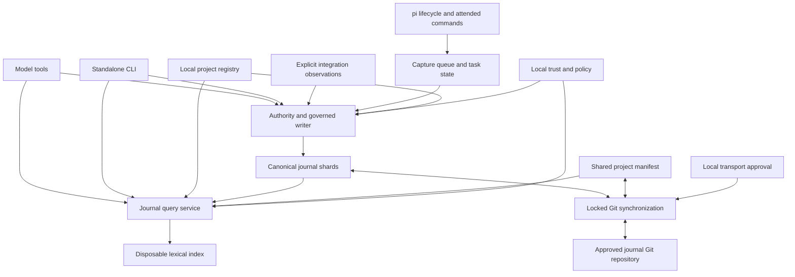

# Architecture

Muninn is a pi extension and a standalone CLI over the same local services. It uses JSONL for canonical evidence, Git for transport and an optional lexical index for retrieval. Storage, search and verification require no hosted service.

## Components

| Area | Responsibility | Implementation |
| --- | --- | --- |
| Entry points | Register pi tools, hooks and commands; parse Unix commands. | `src/index.ts`, `src/cli.ts`, `src/commands/` |
| Identity | Resolve a trusted working directory to an opaque project, member and host. | `src/project/`, `src/store/host.ts` |
| Capture | Detect explicit user cues, accumulate task work, generate outcomes, persist resume state. | `src/capture/` |
| Memory | Select a model, extract structured lessons, chunk branch evidence and replay prepared writes. | `src/memory/` |
| Assisted recall | Expand lexical queries, select bounded evidence and revalidate corrections. | `src/recall/` |
| Write boundary | Enforce caller authority, policy, idempotency, redaction and canonical appends. | `src/journal/writer.ts`, `record.ts`, `jsonl.ts` |
| Retrieval | Validate filters, project relations and lifecycle, rank and bound responses. | `src/journal/query.ts`, `relations.ts`, `query-index.ts` |
| Synchronization | Commit, fetch, validate identity/ownership, rebase and push. | `src/sync/`, `src/git.ts` |
| Governance | Local private identity and pins, public descriptors, verification and prospective enforcement. | `src/governance/`, `src/team/` |
| Integrations | Bounded external observations, enclave audit summaries and encrypted transcript exchange. | `src/integrations/` |
| Diagnostics | Read-only inspection and actionable health reports. | `src/doctor.ts` |

## Data ownership

There are three storage boundaries:

1. **Code checkout:** authoritative code and instructions. It may contain settings that disable capabilities and a narrow project-ID hint for explicit linking. It cannot silently select another local journal.
2. **Journal repository:** shared `project.json`, writer-owned JSONL and an optional migration manifest. Shared content is evidence to validate, including public signing keys. Private keys, trust decisions and transcripts are excluded.
3. **Local agent state:** project registry, host/private identities, pending signing transactions, trust files, pi sessions and imported transcript copies. The journal's local Git configuration also holds transport approval; it is not cloned or synchronized.

The precise layouts are in the [journal](project-journal-format.md) and [registry](project-registry.md) contracts.

## Authority boundaries

A model tool can append an agent note or annotation. Automatic capture can create agent outcomes or checkpoints. An integration creates external observations. Direct human actions create user notes, corrections and conflict resolutions. A signature never widens these permissions.

Local trust pins establish identity; synchronized self-proofs do not. Repository hosting permissions decide who may fetch or push; retirement and cryptographic revocation do not alter those permissions. Locally approved transport chooses where sync sends data, independently of advertised URLs in shared metadata.

## Dependency and deployment shape

The runtime is TypeScript authored and JavaScript distributed. `tsc` emits `dist/` with rewritten relative imports and declarations. The npm package exposes the extension and integration protocol plus the `muninn` executable. Both entry points use the same services; they do not communicate over a daemon or private HTTP API.

The pi fork supplies extension and model APIs. `proper-lockfile` provides process coordination, and Node's crypto module provides Ed25519. The optional `age` executable handles transcript encryption. The pi 0.85.0 package's missing server dependency is supplied explicitly; see [testing and compatibility](testing.md).
